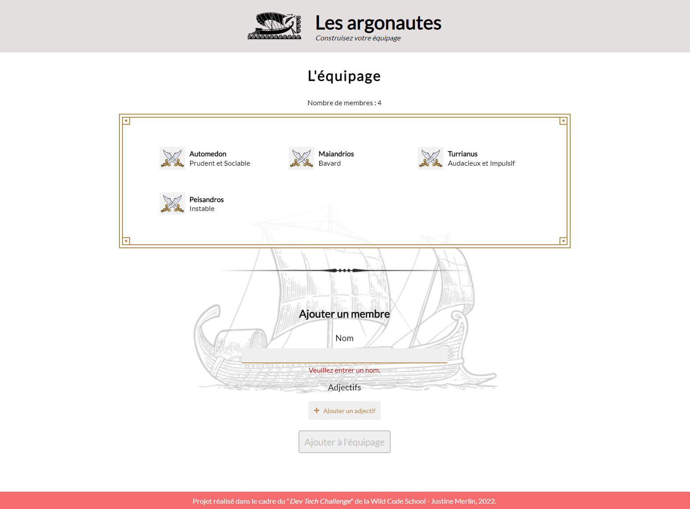
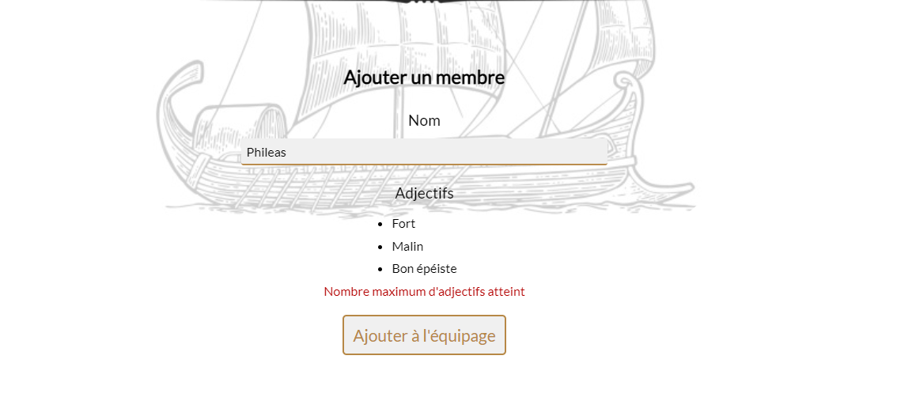

# Wild Code School Dev Tech Challenge - Argo Crew

This project was made for the admission test into Wild Code School workstudy program. With a time limit of 4 days, objectives was to build a client app that communicate with an api and a database.

See the result [here](https://argo-crew.netlify.app/).

## Technologies and libraries

#### For client app :
* ReactJS
* TypeScript

#### For backend app :
* ExpressJS

#### Database :
* MongoDB

## Initialization

This repo contain 2 orphans main branch, one for client app and the other for backend app.

1. Clone this repo
2. Run command `cd ArgoCrew`

#### For client app :
1. Be sure to be on `client-main` branch and run command `npm install`
2. To start server, run command `npm start`

#### For backend app :
1. Be sure to be on `back-main` branch and run command `npm install`
2. To start server, run command `npm run dev`

## Screenshots

